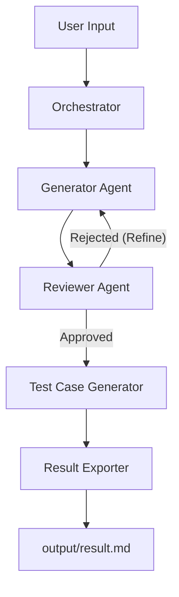

# Prompt Generator Agent

A modular, production-grade AI agent designed to **generate, review, and test prompts** using an iterative 3-stage pipeline. Optimized for professional prompt engineering, it supports 100+ LLMs via LiteLLM and provides dedicated support for local execution via Ollama.

## 🚀 Key Features

- **3-Stage Pipeline**: 
    1. **Generate**: Creates a structured prompt using prompt engineering frameworks like CLEAR, RCT, or CRISP.
    2. **Review**: Evaluates the prompt against professional prompt engineering standards (JSON-based audit).
    3. **Test Cases**: Generates high-quality test scenarios for the approved results.
- **Multi-Provider Support**: Seamlessly switch between OpenAI, Gemini, Anthropic (via LiteLLM), or local models (via Ollama).
- **System Prompt Architecture**: Every agent uses a dedicated system prompt for superior instruction adherence.
- **Robust Parsing**: Advanced JSON extraction with regex fallbacks and code-block sensing.
- **Result Export**: Automatically saves every run into timestamped markdown files in the `output/` directory.

## Process Flow (Round-Trip Example)

Here is how data flows through the system during a typical run:



### Example Walkthrough:
1. **Input**: User asks for a "Python code reviewer prompt".
2. **Generation**: `PromptGenerator` queries the `MemoryManager` for best practices and creates a structured prompt using the **RCT (Role-Context-Task)** framework.
3. **Review**: `PromptReviewer` performs a JSON-based audit. 
    - *Verdict*: `Rejected` (Iteration 1).
    - *Feedback*: "Add instructions for security vulnerability checks."
4. **Refinement**: `PromptGenerator` receives the feedback and updates the prompt.
5. **Approval**: `PromptReviewer` rates the new version **5/5** and approves it.
6. **Validation**: `TestCaseGenerator` reads quality standards from `benchmark.pdf` and generates 5 edge-case scenarios (e.g., "Reviewing an empty file", "Reviewing obfuscated code").
7. **Delivery**: The `Exporter` saves the final prompt, the full review audit, and all test cases into a neat Markdown file in the `output/` directory.

## 🛠️ Setup & Configuration

### Prerequisites
- Python 3.8+
- [Ollama](https://ollama.com/) (if running locally)
- API key of any llm provider

### Installation
```bash
# Clone the repository
git clone <repo-url>
cd prompt-generator-agent

# Create and activate virtual environment
python -m venv .venv
source .venv/bin/activate

# Install dependencies
pip install -e .

# Create your environment file
cp .env.example .env
```
> [!IMPORTANT]
> A `.env` file must be present in the root directory for the application to load configurations and API keys correctly.

### LLM Configuration
Edit the `.env` file you just created:

#### Using OpenAI SDK (Default with ollama)
1. Configure settings:
```python
PROVIDER = "openai"
MODEL_NAME = "llama3.1:8b" # Or your compatible model name
```
2. Add `OPENAI_API_KEY` to your `.env` file.
3. (Optional) Set `OPENAI_BASE_URL` in `.env` to use compatible services like OpenRouter or DeepSeek, etc..

#### Using LiteLLM (Cloud Providers)
1. Configure settings:
   ```python
   PROVIDER = "litellm"
   MODEL_NAME = "gemini/gemini-2.0-flash" # or "openai/gpt-4"
   ```
2. Add your API keys to the `.env` file.

#### Using Local Ollama 
1. Ensure Ollama is running: `ollama run llama3.1:8b`
2. Configure settings:
```python
PROVIDER = "ollama"
MODEL_NAME = "llama3.1:8b"
```

#### API key examples in .env file

```
OPENAI_API_KEY=your-api-key-here
ANTHROPIC_API_KEY=your-api-key-here
GEMINI_API_KEY=your-api-key-here
OLLAMA_API_KEY=your-api-key-here
HUGGINGFACEHUB_ACCESS_TOKEN=your-api-key-here
```

## 🖥️ Usage

### Command Line Interface
Run the interactive CLI to generate prompts:
```bash
python src/cli.py
```

### Streamlit Web UI
Launch the graphical interface:
```bash
streamlit run src/ui.py
```

## 📁 Project Structure
- `src/agent/`: Core agent logic (Generators, Reviewers, Test Architects).
- `src/core/providers/`: LLM interface implementations.
- `src/core/utils/`: Exporters, loggers, and parsing utilities.
- `output/`: Automatically saved results in Markdown format.
